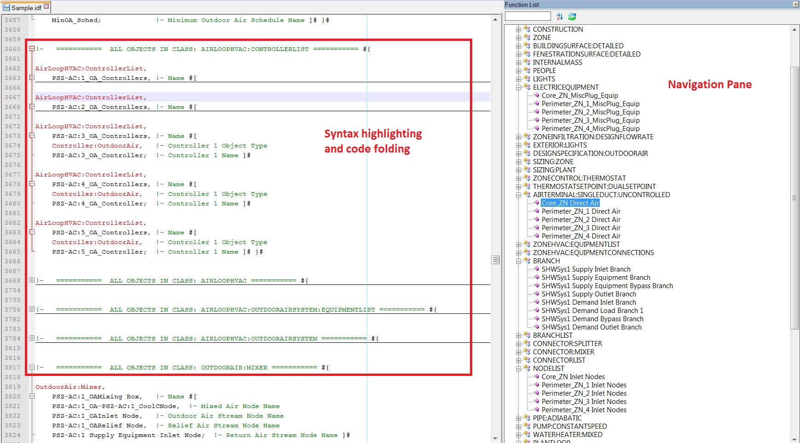

Notepad++ for eQuest and EnergyPlus
=======

# This repository is unmaintained

cf [#6 - Repository is unmaintained](https://github.com/jmarrec/notepad/issues/6)

This repository is currently unmaintained and does not work with Notepad++ 8.1.5+. It's been reported in [#4](https://github.com/jmarrec/notepad/issues/4) alongside some apparently simple steps to make it work.

I just haven't used Notepad++ (nor Windows) in more than 7 years, so I just don't have enough time and interest to fix it.

Pull requests, or offer to maintain it are more than welcome.

## Goals

I use Notepad++ for energy modeling on a daily basis, with both eQuest and EnergyPlus.

Those two programs have something in common: the input file is text-based, and it's quite long.

I found myself wanting two things: syntax highlighting to be able to quickly see the important keywords while scrolling down, and some kind of navigation pane in order to quickly jump to a specific section of a file.

In order to achieve syntax highlighting, I've simply created user defined languages.

In order to achieve a navigation pane, I had to use an advanced function of Notepad++ called Function List.

What you'll get out of it will look like this:

One the above picture you can see syntax highlighting on an eQuest Input File (.inp). To the right, you have the "Function List" pane that serves as a navigation pane:
- You get classes (major sections)
- You can expend them to get an anchor to any specific object

Similar results are obtained for EnergyPlus as well (see screenshot in "Code Folding" below)

## Installation:

Use the shortcut [Windows] + R to bring up the run prompt, and type in : *%appdata%/notepad++*

Windows Explorer will open to the folder in which you'll find functionList.xml, userDefinedLang.xml and shortcuts.xml. Those files are loaded by Notepad++ 

All functionlist and user-defined languages come in **three flavors**:

- **Energyplus and eQuest**: all files are full featured, meaning they include default notepad++ functionList as well, and are **ready to simply replace the existing files: it is preferred for novice users**. Just override your local files with those.
    * It's important to properly download the files. If you just go to the [eQuest and EnergyPlus](https://github.com/jmarrec/notepad/tree/master/eQuest%20and%20EnergyPlus) folder and do a 'right click > save as', it won't work. You have to go to the Raw file and then save.
    * For your convenience, here are direct links to the [functionList.xml](https://raw.githubusercontent.com/jmarrec/notepad/master/eQuest%20and%20EnergyPlus/functionList.xml) and [userDefineLang.xml](https://raw.githubusercontent.com/jmarrec/notepad/master/eQuest%20and%20EnergyPlus/userDefineLang.xml) (with those you can right click and 'save as' directly)

- **EnergyPlus Only**, and **eQuest Only**: for those flavors, you'll have to copy the relevant sections and paste them in your functionList.xml and userDefinedLang.xml in the correct location (look at the xml tags)

**Make sure you do any overwriting and/or save on those files while Notepad++ is closed.**

### Enabling Function List (navigation pane)

**In order to see the "navigation pane", you'll have to enable Function list** under View > Function List:

## Additional resources:

### Code folding for EnergyPlus

In 'Code Folding for EPlus' you'll find a macro that includes opening and closing statements to your IDF file in order to be able to fold code. It's useful in order to only display select sections, but most of the time the navigation pane should be enough.

It's using the comments that are auto-generated when saving via the IDF editor, and I'm assuming it's in **"sortedorder"** (IDF editor > File > Save Options > Sorted) considering I'm also folding the classes. 

The macro is basically performing a few Find and replace based on regular expression.

**To install:**

1) You will need to modify the "shortcuts.xml" file located in "%appdata%\Notepad++/" and add the macro. 
Make sure you save shortcuts.xml while Notepad++ is closed.

2) Then you can reopen notepad++, and under "Macro", run the one called "Add brackets to Eplus classes". Then try folding level 2 with ALT+2, then the rest with ALT+1. You can also manually click on all "+" and "-" signs next to line numbers.

3) Note that each time you'll save the file from the IDF editor, the statements will disappear and you'll have to run the macro again.

### New Addition: Solarized Theme

I added a Solarized theme for EnergyPlus only to the 'eQuest and EnergyPlus\userDefineLang.xml' file. To enable the Solarized theme that ships with notepad++, go to Settings > 'Style Configurator' and pick the 'Solarized' theme.

You can then use the user-defined language called 'EnergyPlus-JM-Solarized'

### Contact and Contribution

**Happy modeling and don't hesitate to reach out to me for any bugs or comments.**

I'll also welcome pull request.
